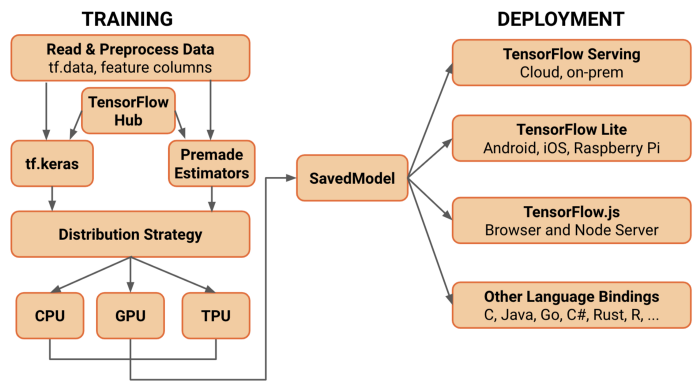

# tfgo：Go中的TensorFlow
[](https://godoc.org/github.com/galeone/tfgo)
[](https://travis-ci.org/galeone/tfgo)
---

- [tfgo：Go中的TensorFlow](#tfgo-Go中的TensorFlow)
  - [依赖关系](#依赖关系)
  - [安装](#安装)
  - [入门指南](#入门指南)
  - [使用数据流图的计算机视觉](#使用数据流图的计算机视觉)
  - [在Python中训练，在Go中服务](#在Python中训练，在Go中服务)
    - [Python代码](#Python代码)
    - [Go代码](#Go代码)
  - [为什么？](#为什么?)
  - [贡献](#贡献)
  - [TensorFlow安装](#TensorFlow安装)
    - [手册](#手册)
    - [Docker](#docker)

TensorFlow的Go绑定 [很难使用](https://pgaleone.eu/tensorflow/go/2017/05/29/understanding-tensorflow-using-go/): tfgo让它变得简单！

不再有以下问题：

- 作用域：每个新节点都将有一个新的唯一名称
- Typing：属性自动转换为支持的类型，而不是在运行时抛出错误

此外，它使用 [方法链](https://en.wikipedia.org/wiki/Method_chaining) 让愉快地编写Go代码成为可能。

## 依赖关系

1. TensorFlow-2.9.1. [如何安装tensorflow](#tensorflow-installation)。
2. TensorFlow绑定github.com/galeone/tensorflow。为了在Go中正确使用TensorFlow 2.9.1，我们必须使用我为Go绑定创建的分支。对于go mod代理来说，绑定可能太大，因此您可能想通过执行`go env -w GONOSUMDB="github.com/galeone/tensorflow"`来关闭代理使用，以直接使用系统安装的git提取代码。它不会改变用户界面中的内容——您可以像往常一样使用go模块。

## 安装

```
go get github.com/galeone/tfgo
```

## 入门指南

TensorFlow的Go绑定的核心数据结构是`op.Scope`结构。tfgo允许创建新的`*op.Scope`来解决上述范围界定问题。

因为我们定义的是一个图，所以让我们从它的根（空图）开始

```go
root := tg.NewRoot()
```

我们现在可以将节点放置到此图中并连接它们。假设我们想为列向量乘以矩阵，然后在结果中添加另一个列向量。

这是完整的源代码。

```go
package main

import (
        "fmt"
        tg "github.com/galeone/tfgo"
        tf "github.com/galeone/tensorflow/tensorflow/go"
)

func main() {
        root := tg.NewRoot()
        A := tg.NewTensor(root, tg.Const(root, [2][2]int32{{1, 2}, {-1, -2}}))
        x := tg.NewTensor(root, tg.Const(root, [2][1]int64{{10}, {100}}))
        b := tg.NewTensor(root, tg.Const(root, [2][1]int32{{-10}, {10}}))
        Y := A.MatMul(x.Output).Add(b.Output)
        // 请注意，Y只是指向A的指针！

        //如果我们想在图中创建不同的节点，我们必须克隆Y或等效的A
        Z := A.Clone()
        results := tg.Exec(root, []tf.Output{Y.Output, Z.Output}, nil, &tf.SessionOptions{})
        fmt.Println("Y: ", results[0].Value(), "Z: ", results[1].Value())
        fmt.Println("Y == A", Y == A) // ==> true
        fmt.Println("Z == A", Z == A) // ==> false
}
```

产生

```
Y:  [[200] [-200]] Z:  [[200] [-200]]
Y == A true
Z == A false
```

可用方法列表可在GoDoc上找到: http://godoc.org/github.com/galeone/tfgo

## 使用数据流图的计算机视觉

TensorFlow有很多方法可以对图像执行操作。tfgo提供了`image`包，允许使用Go绑定以优雅的方式执行计算机视觉任务。

例如，可以读取图像，计算其沿水平和垂直方向的方向导数，计算梯度并保存。

下面的代码做到了这一点，显示了使用相关性和卷积操作实现的不同结果。

```go
package main

import (
        tg "github.com/galeone/tfgo"
        "github.com/galeone/tfgo/image"
        "github.com/galeone/tfgo/image/filter"
        "github.com/galeone/tfgo/image/padding"
        tf "github.com/galeone/tensorflow/tensorflow/go"
        "os"
)

func main() {
        root := tg.NewRoot()
        grayImg := image.Read(root, "/home/pgaleone/airplane.png", 1)
        grayImg = grayImg.Scale(0, 255)

        // 使用sobel滤波器的边缘检测：卷积
        Gx := grayImg.Clone().Convolve(filter.SobelX(root), image.Stride{X: 1, Y: 1}, padding.SAME)
        Gy := grayImg.Clone().Convolve(filter.SobelY(root), image.Stride{X: 1, Y: 1}, padding.SAME)
        convoluteEdges := image.NewImage(root.SubScope("edge"), Gx.Square().Add(Gy.Square().Value()).Sqrt().Value()).EncodeJPEG()

        Gx = grayImg.Clone().Correlate(filter.SobelX(root), image.Stride{X: 1, Y: 1}, padding.SAME)
        Gy = grayImg.Clone().Correlate(filter.SobelY(root), image.Stride{X: 1, Y: 1}, padding.SAME)
        correlateEdges := image.NewImage(root.SubScope("edge"), Gx.Square().Add(Gy.Square().Value()).Sqrt().Value()).EncodeJPEG()

        results := tg.Exec(root, []tf.Output{convoluteEdges, correlateEdges}, nil, &tf.SessionOptions{})

        file, _ := os.Create("convolved.png")
        file.WriteString(results[0].Value().(string))
        file.Close()

        file, _ = os.Create("correlated.png")
        file.WriteString(results[1].Value().(string))
        file.Close()
}

```

**airplane.png**


**convolved.png**


**correlated.png**


可用方法列表可在GoDoc上找到: http://godoc.org/github.com/galeone/tfgo/image

## 在Python中训练，在Go中服务

TensorFlow 2提供了很多简单的方法，可以将计算图形（例如Keras模型或用`@tf.function`修饰的函数）导出为`SavedModel`序列化格式（这是唯一官方支持的格式）。



使用TensorFlow 2（带有Keras或tf.function）+tfgo，导出一个经过训练的模型（或通用计算图）并在Go中使用它很简单。

只需深入研究示例，了解如何使用`tfgo`为经过训练的模型服务。

### Python代码

```python
import tensorflow as tf

model = tf.keras.Sequential(
    [
        tf.keras.layers.Conv2D(
            8,
            (3, 3),
            strides=(2, 2),
            padding="valid",
            input_shape=(28, 28, 1),
            activation=tf.nn.relu,
            name="inputs",
        ),  # 14x14x8
        tf.keras.layers.Conv2D(
            16, (3, 3), strides=(2, 2), padding="valid", activation=tf.nn.relu
        ),  # 7x716
        tf.keras.layers.Flatten(),
        tf.keras.layers.Dense(10, name="logits"),  # linear
    ]
)

tf.saved_model.save(model, "output/keras")

```

### Go代码

```go
package main

import (
        "fmt"
        tg "github.com/galeone/tfgo"
        tf "github.com/galeone/tensorflow/tensorflow/go"
)

func main() {
        // A model exported with tf.saved_model.save()
        // automatically comes with the "serve" tag because the SavedModel
        // file format is designed for serving.
        // This tag contains the various functions exported. Among these, there is
        // always present the "serving_default" signature_def. This signature def
        // works exactly like the TF 1.x graph. Get the input tensor and the output tensor,
        // and use them as placeholder to feed and output to get, respectively.

        // To get info inside a SavedModel the best tool is saved_model_cli
        // that comes with the TensorFlow Python package.

        // e.g. saved_model_cli show --all --dir output/keras
        // gives, among the others, this info:

        // signature_def['serving_default']:
        // The given SavedModel SignatureDef contains the following input(s):
        //   inputs['inputs_input'] tensor_info:
        //       dtype: DT_FLOAT
        //       shape: (-1, 28, 28, 1)
        //       name: serving_default_inputs_input:0
        // The given SavedModel SignatureDef contains the following output(s):
        //   outputs['logits'] tensor_info:
        //       dtype: DT_FLOAT
        //       shape: (-1, 10)
        //       name: StatefulPartitionedCall:0
        // Method name is: tensorflow/serving/predict

        model := tg.LoadModel("test_models/output/keras", []string{"serve"}, nil)

        fakeInput, _ := tf.NewTensor([1][28][28][1]float32{})
        results := model.Exec([]tf.Output{
                model.Op("StatefulPartitionedCall", 0),
        }, map[tf.Output]*tf.Tensor{
                model.Op("serving_default_inputs_input", 0): fakeInput,
        })

        predictions := results[0]
        fmt.Println(predictions.Value())
}
```

## 为什么?

考虑到用图形表示的计算，用这种方式描述计算是很有挑战性的。

此外，tfgo将GPU计算引入Go，并允许编写并行代码，而无需担心执行它的设备（只需将图形放入您想要的设备中：就是这样！）

## 贡献

我喜欢贡献。认真地拥有与你志趣相投、想面对同样挑战的人，真是太棒了。

如果您想贡献，只需深入研究代码，看看可以添加或改进什么。开始讨论一个问题，让我们讨论一下。

只需遵循我在`image`包中使用的相同设计（“覆盖”相同的`Tensor`方法、记录方法、测试更改……）

有很多包可以添加，比如`image`包。请随意编写一个全新的包：我很想看到这种贡献！

## TensorFlow安装

### 手册

从 https://www.tensorflow.org/install/lang_c 下载并安装C库 

```bash
curl -L "https://storage.googleapis.com/tensorflow/libtensorflow/libtensorflow-cpu-linux-x86_64-2.9.1.tar.gz" | sudo tar -C /usr/local -xz
sudo ldconfig
```

### Docker

```bash
docker pull tensorflow/tensorflow:2.9.1
```

或者您可以使用系统包管理器。
